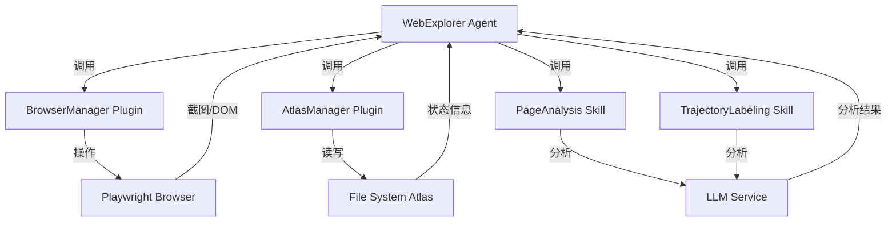

# WebExplorer Agent - 技术PRD

**基于AgentBus架构的实现方案**

---

## 📋 文档信息

| 项目 | 内容 |
|------|------|
| **文档版本** | v1.0 |
| **创建日期** | 2026-01-31 |
| **最后更新** | 2026-01-31 |
| **状态** | 设计中 |
| **负责人** | AgentBus Team |

---

## 1. 项目概述

### 1.1 产品定位

WebExplorer Agent 是一个基于 AgentBus 平台的智能网页探索和测试系统,采用"先交互后建图"的策略,通过文件系统构建网站状态地图,实现自主遍历和回溯测试。

### 1.2 核心理念

- **Interaction-First**: 先执行交互,再根据结果决定是否记录
- **Atlas Memory**: 使用文件系统作为状态数据库,目录即节点,软链接即边
- **FSM-Driven**: Agent内部使用有限状态机驱动探索和测试流程

### 1.3 技术栈

| 层次 | 技术选型 | 说明 |
|------|---------|------|
| **底座** | AgentBus | 三层架构(入口/编排/子系统) |
| **浏览器** | Playwright | 已集成在automation模块 |
| **LLM** | 可配置 | 支持OpenAI/vLLM等 |
| **文件系统** | Python pathlib + os | 跨平台文件操作 |
| **数据格式** | JSON | 元数据和配置 |

---

## 2. 架构设计

### 2.1 AgentBus组件映射

基于对AgentBus现有架构的分析,将PRD中的逻辑角色映射到具体组件:

```
原始PRD角色          →  AgentBus组件类型  →  实现位置
━━━━━━━━━━━━━━━━━━━━━━━━━━━━━━━━━━━━━━━━━━━━━━━━━━━━━━
执行手(BrowserManager)  →  Plugin          →  plugins/web_explorer/browser_manager.py
地图官(AtlasManager)    →  Plugin          →  plugins/web_explorer/atlas_manager.py
军师(PageAnalysis)      →  Skill           →  skills/web_explorer/page_analysis.py
史官(TrajectoryLabeling)→  Skill           →  skills/web_explorer/trajectory_labeling.py
队长(WebExplorer)       →  Agent           →  agents/web_explorer/explorer_agent.py
```

### 2.2 目录结构设计

```
AgentBus/
├── plugins/
│   └── web_explorer/              # WebExplorer插件包
│       ├── __init__.py
│       ├── browser_manager.py     # BrowserManager插件
│       └── atlas_manager.py       # AtlasManager插件
│
├── skills/
│   └── web_explorer/              # WebExplorer技能包
│       ├── __init__.py
│       ├── page_analysis.py       # PageAnalysis技能
│       └── trajectory_labeling.py # TrajectoryLabeling技能
│
├── agents/
│   └── web_explorer/              # WebExplorer Agent包
│       ├── __init__.py
│       ├── explorer_agent.py      # 主Agent类
│       ├── fsm.py                 # 状态机定义
│       └── types.py               # 类型定义
│
├── tests/
│   └── web_explorer/              # 测试代码
│       ├── mock_server.py         # Mock Web服务器
│       ├── test_plugins.py        # 插件测试
│       ├── test_skills.py         # 技能测试
│       └── test_agent.py          # Agent测试
│
└── WIP/                           # 设计文档(开发中)
    ├── PRD_TECHNICAL.md           # 本文档
    ├── DEVELOPMENT_PLAN.md        # 开发计划
    ├── DATA_SCHEMA.md             # 数据协议设计
    └── API_DESIGN.md              # API设计
```

### 2.3 数据流设计



---

## 3. 组件详细设计

### 3.1 BrowserManager Plugin

#### 3.1.1 基本信息

```python
class BrowserManagerPlugin(AgentBusPlugin):
    NAME = "browser_manager"
    VERSION = "1.0.0"
    DESCRIPTION = "浏览器操作管理插件,支持意图执行、脚本录制和回放"
```

#### 3.1.2 核心功能

**功能1: execute_intent**

```python
async def execute_intent(self, intent: str, context: Dict[str, Any]) -> Dict[str, Any]:
    """
    执行模糊意图指令
    
    Args:
        intent: 模糊指令,如"点击登录按钮"
        context: 上下文信息(当前URL、页面状态等)
    
    Returns:
        {
            "success": bool,
            "action_type": str,  # click/type/navigate等
            "selector": str,     # 实际使用的选择器
            "screenshot_before": str,  # 操作前截图路径
            "screenshot_after": str,   # 操作后截图路径
            "error": str | None
        }
    
    实现要点:
    - 使用LLM将模糊意图转换为具体选择器
    - 调用automation.browser进行实际操作
    - 在内存中缓存操作步骤(self._action_history)
    - 操作前后自动截图
    """
```

**功能2: save_script**

```python
async def save_script(self, script_path: str, metadata: Dict[str, Any]) -> bool:
    """
    将内存中的操作历史保存为Python脚本
    
    Args:
        script_path: 脚本保存路径
        metadata: 脚本元数据(名称、描述等)
    
    Returns:
        是否保存成功
    
    实现要点:
    - 从self._action_history读取操作序列
    - 生成可执行的Python代码
    - 包含必要的import和初始化代码
    - 添加注释和元数据
    """
```

**功能3: replay_teleport**

```python
async def replay_teleport(self, script_paths: List[str]) -> Dict[str, Any]:
    """
    按顺序执行脚本链,快速恢复到目标状态
    
    Args:
        script_paths: 脚本路径列表,按执行顺序排列
    
    Returns:
        {
            "success": bool,
            "executed_scripts": List[str],
            "final_url": str,
            "error": str | None
        }
    
    实现要点:
    - 重启浏览器到干净状态
    - 按顺序加载并执行每个脚本
    - 验证每步执行结果
    - 支持失败回滚
    """
```

#### 3.1.3 依赖关系

- **依赖**: `automation.browser.BrowserAutomation`
- **被依赖**: `WebExplorer Agent`

### 3.2 AtlasManager Plugin

#### 3.2.1 基本信息

```python
class AtlasManagerPlugin(AgentBusPlugin):
    NAME = "atlas_manager"
    VERSION = "1.0.0"
    DESCRIPTION = "文件系统状态地图管理插件"
```

#### 3.2.2 核心功能

**功能1: ensure_state**

```python
async def ensure_state(
    self, 
    url: str, 
    dom_fingerprint: str,
    screenshot_path: str,
    metadata: Optional[Dict[str, Any]] = None
) -> Dict[str, Any]:
    """
    确保状态节点存在
    
    Args:
        url: 页面URL
        dom_fingerprint: DOM指纹(用于计算Hash)
        screenshot_path: 截图路径
        metadata: 额外元数据
    
    Returns:
        {
            "node_id": str,        # 状态Hash
            "node_path": str,      # 目录路径
            "is_new": bool,        # 是否新创建
            "meta_file": str       # meta.json路径
        }
    
    实现要点:
    - 使用hashlib计算指纹Hash
    - 检查project_memory/{hash}是否存在
    - 新建目录时创建标准子目录结构
    - 写入meta.json
    - 更新全局index.json
    """
```

**功能2: link_state**

```python
async def link_state(
    self,
    source_node_id: str,
    action_name: str,
    target_node_id: str
) -> bool:
    """
    在两个状态节点间创建软链接
    
    Args:
        source_node_id: 源节点ID
        action_name: 动作名称(用作链接名)
        target_node_id: 目标节点ID
    
    Returns:
        是否创建成功
    
    实现要点:
    - 在源节点的links/目录下创建软链接
    - 链接名格式: action_{action_name}
    - 使用os.symlink或pathlib.Path.symlink_to
    - 处理Windows/Linux兼容性
    """
```

**功能3: manage_todos**

```python
async def manage_todos(
    self,
    node_id: str,
    mode: str,  # "push" or "pop"
    tasks: Optional[List[Dict[str, Any]]] = None
) -> Union[List[Dict[str, Any]], bool]:
    """
    管理节点的待办任务
    
    Args:
        node_id: 节点ID
        mode: "push"添加任务, "pop"获取任务
        tasks: 任务列表(push模式时需要)
    
    Returns:
        push模式: 是否成功
        pop模式: 任务列表
    
    实现要点:
    - push: 在todos/目录下创建JSON文件
    - pop: 按priority排序,移动到processing/
    - 使用文件锁防止并发问题
    """
```

#### 3.2.3 文件系统协议

详见 `WIP/DATA_SCHEMA.md`

### 3.3 PageAnalysis Skill

#### 3.3.1 基本信息

```python
class PageAnalysisSkill(BaseSkill):
    NAME = "page_analysis"
    TYPE = SkillType.CUSTOM
    DESCRIPTION = "页面分析技能,使用LLM分析页面并生成探索任务"
```

#### 3.3.2 System Prompt设计

```python
SYSTEM_PROMPT = """
你是一个网页探索专家,负责分析页面并规划探索策略。

输入:
- 页面截图
- 精简DOM树(仅包含可交互元素)
- 当前URL

任务:
1. 理解页面的业务含义
2. 识别所有可交互元素
3. 按优先级排序探索任务

输出JSON格式:
{
    "summary": "页面一句话描述",
    "frontier_tasks": [
        {
            "selector": "CSS选择器",
            "action": "click|type|navigate",
            "reason": "探索理由",
            "priority": 1-10,  # 数字越大优先级越高
            "is_destructive": false  # 是否破坏性操作
        }
    ],
    "test_ideas": [
        {
            "name": "测试点名称",
            "description": "测试描述",
            "type": "boundary|injection|permission"
        }
    ]
}

优先级规则:
- 详情页链接 > 列表页链接 > 导航链接
- 表单提交 < 表单填写
- 删除/修改 < 查看/搜索
"""
```

#### 3.3.3 实现要点

- 调用LLM服务(通过Agent的generate_text)
- 解析JSON输出
- 验证输出格式
- 处理LLM错误

### 3.4 TrajectoryLabeling Skill

#### 3.4.1 System Prompt设计

```python
SYSTEM_PROMPT = """
你是一个行为分析专家,负责判断用户操作是否有意义并生成语义标签。

输入:
- 操作前截图
- 操作描述(如"点击登录按钮")
- 操作后截图

任务:
判断操作是否导致了有意义的状态变化。

无意义的情况:
- 页面完全没变化
- 只是Loading动画闪了一下
- 弹出了错误提示但页面结构未变

有意义的情况:
- 进入了新页面
- 页面内容发生了实质性变化
- 弹出了模态框/侧边栏

输出JSON格式:
{
    "is_meaningful": true|false,
    "semantic_label": "动作的业务含义",
    "script_name": "建议的脚本文件名",
    "confidence": 0.0-1.0  # 判断置信度
}

示例:
{
    "is_meaningful": true,
    "semantic_label": "验证:点击购物车图标成功进入购物车页面",
    "script_name": "nav_to_cart.py",
    "confidence": 0.95
}
"""
```

### 3.5 WebExplorer Agent

#### 3.5.1 状态机设计

```python
class ExplorerState(Enum):
    """Agent状态枚举"""
    IDLE = "idle"                    # 空闲
    LOCATING = "locating"            # 定位当前状态
    ANALYZING = "analyzing"          # 分析页面
    DECIDING = "deciding"            # 决策下一步
    ACTING = "acting"                # 执行动作
    REFLECTING = "reflecting"        # 反思结果
    BACKTRACKING = "backtracking"    # 回溯
    TESTING = "testing"              # 深度测试
    TELEPORTING = "teleporting"      # 瞬移
    COMPLETED = "completed"          # 完成
    ERROR = "error"                  # 错误
```

#### 3.5.2 核心循环

**拓荒循环 (Exploration Loop)**

```python
async def exploration_loop(self):
    """
    拓荒循环主逻辑
    
    状态流转:
    IDLE -> LOCATING -> ANALYZING -> DECIDING -> ACTING -> REFLECTING -> LOCATING
                                         ↓
                                   BACKTRACKING (无任务时)
    """
    while self.state != ExplorerState.COMPLETED:
        if self.state == ExplorerState.LOCATING:
            await self._locate_current_state()
        
        elif self.state == ExplorerState.ANALYZING:
            await self._analyze_page()
        
        elif self.state == ExplorerState.DECIDING:
            await self._decide_next_action()
        
        elif self.state == ExplorerState.ACTING:
            await self._execute_action()
        
        elif self.state == ExplorerState.REFLECTING:
            await self._reflect_on_action()
        
        elif self.state == ExplorerState.BACKTRACKING:
            await self._backtrack()
```

**深测循环 (Testing Loop)**

```python
async def testing_loop(self):
    """
    深度测试循环
    
    状态流转:
    IDLE -> SCANNING -> TELEPORTING -> TESTING -> REPORTING -> SCANNING
    """
    # 扫描所有test_ideas
    test_targets = await self._scan_test_ideas()
    
    for target in test_targets:
        # 瞬移到目标状态
        await self._teleport_to_state(target["node_id"])
        
        # 执行测试
        result = await self._execute_test(target["test_idea"])
        
        # 生成报告
        await self._generate_report(result)
```

---

## 4. 数据协议

### 4.1 文件系统结构

详见 `WIP/DATA_SCHEMA.md`

### 4.2 JSON Schema

#### meta.json

```json
{
  "$schema": "http://json-schema.org/draft-07/schema#",
  "type": "object",
  "required": ["id", "url", "created_at"],
  "properties": {
    "id": {"type": "string"},
    "url": {"type": "string"},
    "summary": {"type": "string"},
    "source_action": {"type": "string"},
    "created_at": {"type": "string", "format": "date-time"},
    "dom_fingerprint": {"type": "string"},
    "screenshot": {"type": "string"}
  }
}
```

---

## 5. 接口设计

详见 `WIP/API_DESIGN.md`

---

## 6. 测试策略

### 6.1 单元测试

- 每个Plugin的每个功能独立测试
- 每个Skill的输入输出测试
- Agent状态机转换测试

### 6.2 集成测试

- Plugin + Skill集成测试
- Agent + Plugin + Skill端到端测试

### 6.3 验收测试

使用Mock Server进行完整场景测试,详见原始PRD第6节。

---

## 7. 风险与挑战

### 7.1 技术风险

| 风险 | 影响 | 缓解措施 |
|------|------|---------|
| LLM输出不稳定 | 高 | 添加输出验证和重试机制 |
| 软链接跨平台兼容性 | 中 | 使用pathlib抽象,提供fallback方案 |
| 循环检测失效 | 高 | 多重检测机制(Hash+路径+时间) |
| 脚本回放失败 | 中 | 添加容错和人工介入机制 |

### 7.2 设计挑战

| 挑战 | 解决方案 |
|------|---------|
| DOM指纹如何计算 | 使用关键元素的组合Hash |
| 如何判断页面"相同" | URL+DOM指纹双重判断 |
| 回溯时如何找到父节点 | 维护parent_id字段 |
| 如何处理动态内容 | 忽略时间戳等动态元素 |

---

## 8. 开发里程碑

详见 `WIP/DEVELOPMENT_PLAN.md`

---

## 9. 附录

### 9.1 术语表

| 术语 | 定义 |
|------|------|
| **状态节点** | 文件系统中的一个目录,代表网站的一个状态 |
| **软链接** | 目录间的符号链接,代表状态转换 |
| **拓荒循环** | 探索新状态的主循环 |
| **深测循环** | 执行测试用例的循环 |
| **瞬移** | 通过脚本链快速恢复到目标状态 |

### 9.2 参考资料

- AgentBus架构文档: `docs/EXTENSION_DEVELOPMENT_GUIDE.md`
- Playwright文档: https://playwright.dev/python/
- 原始PRD: 用户提供的需求文档

---

**文档状态**: 初稿完成,待评审  
**下一步**: 创建详细的开发计划和数据协议文档
