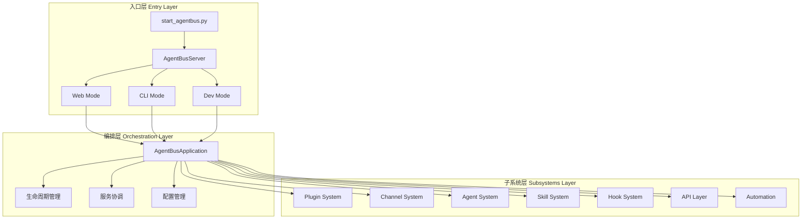
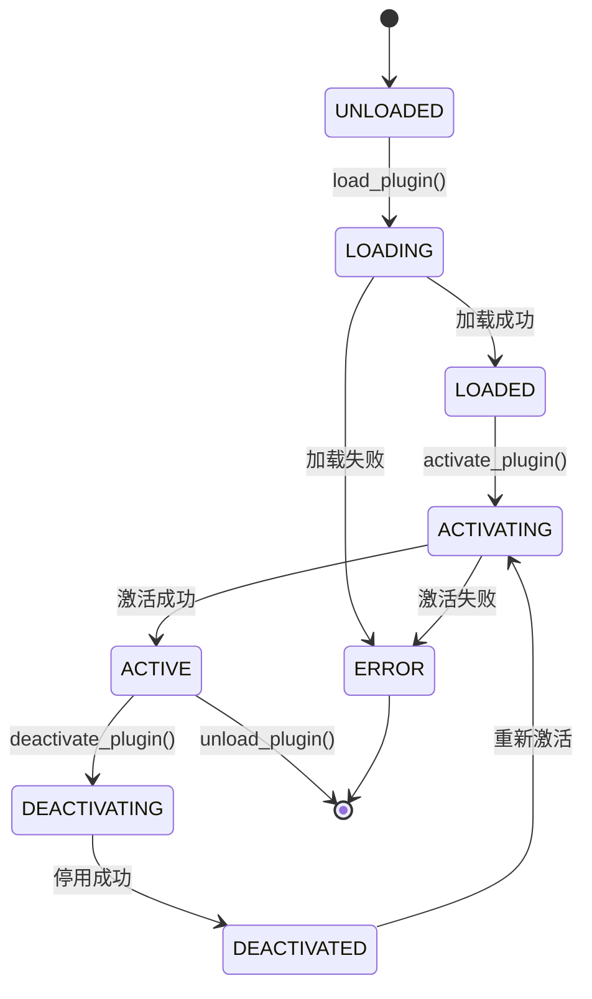
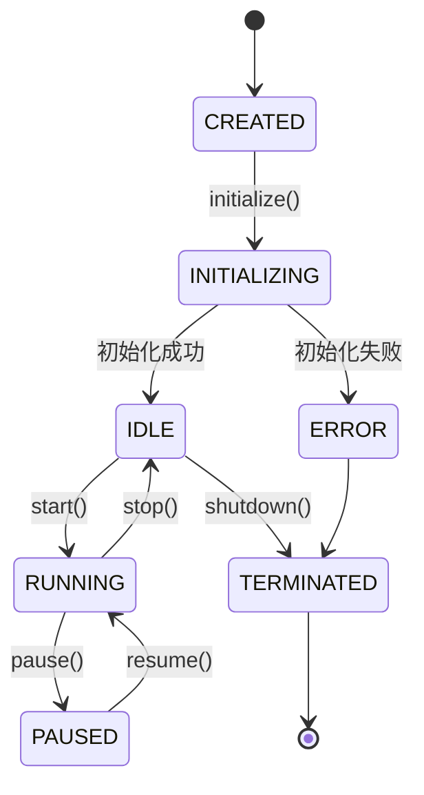
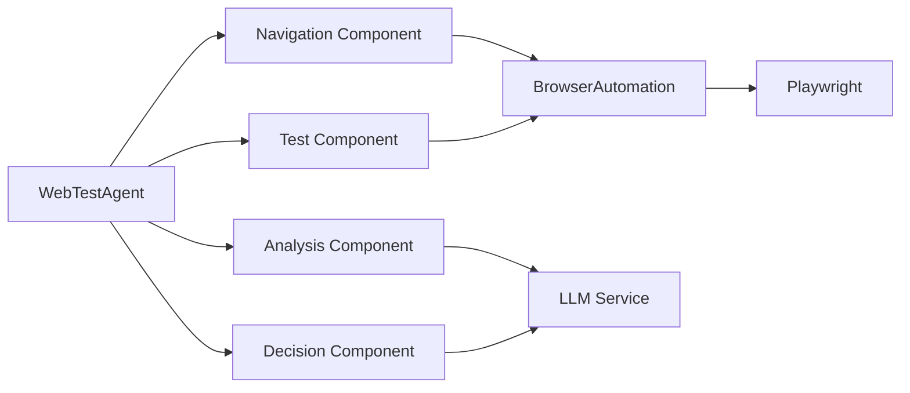

# AgentBus 扩展开发文档

> **面向大模型的技术指南** - 用于基于AgentBus底座开发自定义组件和Agent

## 📋 文档概述

本文档为AI大模型提供AgentBus平台的扩展开发指南,帮助理解架构设计并开发自定义组件。重点介绍:

- **核心架构** - 三层架构设计与组件交互
- **插件开发** - 动态扩展功能的插件系统
- **Agent开发** - 自主智能体的创建与管理
- **技能开发** - 可复用的技能模块
- **自动化系统** - 基于Playwright的浏览器控制
- **实战案例** - 网页自主遍历测试Agent开发

---

## 🏗️ 架构概览

### 三层架构设计

AgentBus采用清晰的三层架构,实现高度模块化和可扩展性:



### 核心组件职责

| 组件 | 文件路径 | 核心职责 |
|------|---------|---------|
| **入口层** | `start_agentbus.py` | 启动服务器,解析命令行参数 |
| **服务器** | `core/app.py::AgentBusServer` | 统一服务器入口,支持多种运行模式 |
| **应用编排** | `core/main_app.py::AgentBusApplication` | 协调所有子系统,管理生命周期 |
| **插件系统** | `plugins/manager.py::PluginManager` | 插件发现、加载、激活、卸载 |
| **Agent系统** | `agents/core/base.py::BaseAgent` | Agent基类,状态管理,任务执行 |
| **技能系统** | `skills/manager.py::SkillLifecycleManager` | 技能生命周期,健康检查 |
| **Hook系统** | `hooks/manager.py::HookManager` | 事件钩子,生命周期拦截 |
| **自动化** | `automation/browser.py::BrowserAutomation` | Playwright浏览器控制 |
| **API层** | `api/main.py::create_app` | FastAPI路由,WebSocket |

---

## 🔌 核心概念

### 1. 插件系统 (Plugin System)

插件是AgentBus最基本的扩展单元,通过继承`AgentBusPlugin`基类实现。

#### 插件生命周期



#### 插件核心类

**基类**: `plugins/core.py::AgentBusPlugin`

```python
class AgentBusPlugin(ABC):
    """插件基类"""
    
    def __init__(self, plugin_id: str, context: PluginContext):
        self.plugin_id = plugin_id
        self.context = context
        self.status = PluginStatus.UNLOADED
        self._tools: List[PluginTool] = []
        self._hooks: Dict[str, List[PluginHook]] = {}
    
    @abstractmethod
    def get_info(self) -> Dict[str, Any]:
        """返回插件元信息"""
        pass
    
    async def activate(self) -> bool:
        """激活插件"""
        pass
    
    async def deactivate(self) -> bool:
        """停用插件"""
        pass
    
    def register_tool(self, name: str, description: str, 
                     function: Callable, **kwargs) -> PluginTool:
        """注册工具"""
        pass
    
    def register_hook(self, event: str, handler: Callable, 
                     priority: int = 0) -> PluginHook:
        """注册事件钩子"""
        pass
```

**管理器**: `plugins/manager.py::PluginManager`

```python
class PluginManager:
    """插件管理器"""
    
    def __init__(self, context: Optional[PluginContext] = None,
                 plugin_dirs: Optional[List[str]] = None):
        self.context = context or PluginContext(...)
        self.plugin_dirs = plugin_dirs or self._get_default_plugin_dirs()
        self._plugins: Dict[str, AgentBusPlugin] = {}
        self._tools: Dict[str, PluginTool] = {}
        self._hooks: Dict[str, List[PluginHook]] = {}
    
    async def discover_plugins(self) -> List[PluginInfo]:
        """发现可用插件"""
        pass
    
    async def load_plugin(self, plugin_id: str, module_path: str,
                         class_name: str = None) -> AgentBusPlugin:
        """加载插件"""
        pass
    
    async def activate_plugin(self, plugin_id: str) -> bool:
        """激活插件"""
        pass
    
    async def execute_hook(self, event: str, *args, **kwargs) -> List[Any]:
        """执行事件钩子"""
        pass
    
    async def execute_tool(self, tool_name: str, *args, **kwargs) -> Any:
        """执行工具"""
        pass
```

### 2. Agent系统 (Agent System)

Agent是具有自主能力的智能体,可以执行任务、生成内容、推理决策。

#### Agent状态机



#### Agent核心类

**基类**: `agents/core/base.py::BaseAgent`

```python
class BaseAgent(ABC):
    """Agent基类"""
    
    def __init__(self, config: AgentConfig, metadata: AgentMetadata):
        self.config = config
        self.metadata = metadata
        self.state = AgentState(
            status=AgentStatus.CREATED,
            capabilities=set()
        )
        self._event_handlers: Dict[str, List[Callable]] = {}
    
    async def initialize(self) -> bool:
        """初始化Agent"""
        pass
    
    async def start(self) -> bool:
        """启动Agent"""
        pass
    
    async def stop(self) -> bool:
        """停止Agent"""
        pass
    
    async def execute_task(self, task_type: str, 
                          parameters: Dict[str, Any],
                          timeout: Optional[float] = None) -> Dict[str, Any]:
        """执行任务"""
        pass
    
    @abstractmethod
    async def generate_text(self, prompt: str, 
                           system_prompt: Optional[str] = None,
                           context: Optional[List[Dict]] = None) -> str:
        """生成文本"""
        pass
    
    def on_event(self, event_name: str, handler: Callable):
        """注册事件处理器"""
        pass
```

**类型定义**: `agents/core/types.py`

```python
class AgentType(Enum):
    """Agent类型"""
    CONVERSATIONAL = "conversational"  # 对话型
    CODE_GENERATOR = "code_generator"  # 代码生成
    ANALYST = "analyst"                # 分析型
    AUTOMATION = "automation"          # 自动化
    CUSTOM = "custom"                  # 自定义

class AgentStatus(Enum):
    """Agent状态"""
    CREATED = "created"
    INITIALIZING = "initializing"
    IDLE = "idle"
    RUNNING = "running"
    PAUSED = "paused"
    ERROR = "error"
    TERMINATED = "terminated"

@dataclass
class AgentCapability:
    """Agent能力"""
    name: str
    description: str
    enabled: bool = True
    parameters: Dict[str, Any] = field(default_factory=dict)
```

### 3. 技能系统 (Skill System)

技能是可复用的功能模块,提供特定领域的能力(如GitHub操作、Discord消息等)。

#### 技能基类

**基类**: `skills/base.py::BaseSkill`

```python
class BaseSkill(ABC):
    """技能基类"""
    
    def __init__(self, context: SkillContext):
        self.context = context
        self.metadata = self._create_metadata()
        self.status = SkillStatus.INACTIVE
    
    @abstractmethod
    def _create_metadata(self) -> SkillMetadata:
        """创建技能元数据"""
        pass
    
    @abstractmethod
    async def activate(self) -> bool:
        """激活技能"""
        pass
    
    @abstractmethod
    async def deactivate(self) -> bool:
        """停用技能"""
        pass
    
    @abstractmethod
    async def execute(self, action: str, 
                     parameters: Dict[str, Any]) -> Dict[str, Any]:
        """执行技能动作"""
        pass
```

**生命周期管理**: `skills/manager.py::SkillLifecycleManager`

```python
class SkillLifecycleManager:
    """技能生命周期管理器"""
    
    def __init__(self, skill_manager: SkillManager,
                 config: Optional[LifecycleConfig] = None):
        self.skill_manager = skill_manager
        self.config = config or LifecycleConfig()
        self._metrics: Dict[str, SkillMetrics] = {}
        self._health_status: Dict[str, HealthStatus] = {}
    
    async def start(self):
        """启动生命周期管理器"""
        pass
    
    async def _health_check_loop(self):
        """健康检查循环"""
        pass
    
    async def _metrics_collection_loop(self):
        """指标收集循环"""
        pass
```

### 4. Hook系统 (Hook System)

Hook系统提供事件驱动的扩展机制,允许在关键生命周期节点插入自定义逻辑。

#### Hook事件类型

```python
class HookEventType(Enum):
    """Hook事件类型"""
    # 系统生命周期
    SYSTEM_STARTUP = "system.startup"
    SYSTEM_SHUTDOWN = "system.shutdown"
    
    # 插件生命周期
    PLUGIN_LOAD = "plugin.load"
    PLUGIN_ACTIVATE = "plugin.activate"
    PLUGIN_DEACTIVATE = "plugin.deactivate"
    
    # Agent生命周期
    AGENT_INITIALIZE = "agent.initialize"
    AGENT_START = "agent.start"
    AGENT_STOP = "agent.stop"
    
    # 消息处理
    MESSAGE_RECEIVE = "message.receive"
    MESSAGE_SEND = "message.send"
    MESSAGE_PROCESS = "message.process"
```

#### Hook管理器

**管理器**: `hooks/manager.py::HookManager`

```python
class HookManager:
    """Hook管理器"""
    
    def __init__(self, config: Optional[HookConfig] = None,
                 workspace_dir: Optional[str] = None):
        self.config = config or HookConfig()
        self.engine = get_hook_engine()
        self.loader = HookLoader(workspace_dir)
    
    async def initialize(self) -> bool:
        """初始化Hook管理器"""
        pass
    
    async def trigger_event(self, event_type: HookEventType,
                           action: str, session_key: str,
                           context: Optional[HookExecutionContext] = None,
                           **kwargs) -> List[HookResult]:
        """触发事件"""
        pass
    
    def enable_hook(self, hook_name: str) -> bool:
        """启用Hook"""
        pass
    
    def disable_hook(self, hook_name: str) -> bool:
        """禁用Hook"""
        pass
```

### 5. 自动化系统 (Automation System)

基于Playwright的浏览器自动化系统,提供网页交互能力。

#### 浏览器自动化

**核心类**: `automation/browser.py::BrowserAutomation`

```python
class BrowserAutomation:
    """浏览器自动化主类"""
    
    def __init__(self, config: Optional[BrowserConfig] = None):
        self.config = config or BrowserConfig()
        self.playwright_manager = PlaywrightManager()
        self.page_navigator = None
        self.element_finder = None
        self.form_handler = None
        self.screenshot_manager = None
    
    async def start(self) -> BrowserStatus:
        """启动浏览器"""
        pass
    
    async def stop(self):
        """停止浏览器"""
        pass
    
    async def navigate_to(self, url: str, **kwargs) -> bool:
        """导航到URL"""
        pass
    
    async def find_element(self, **kwargs) -> ElementHandle:
        """查找元素"""
        pass
    
    async def click_element(self, **kwargs):
        """点击元素"""
        pass
    
    async def type_text(self, **kwargs):
        """输入文本"""
        pass
    
    async def take_screenshot(self, **kwargs) -> str:
        """截图"""
        pass
```

**元素查找**: `automation/element_finder.py::ElementFinder`

```python
class ElementFinder:
    """元素查找器"""
    
    def __init__(self, page: Page):
        self.page = page
    
    async def find_element(self, selector: Optional[str] = None,
                          text: Optional[str] = None,
                          xpath: Optional[str] = None,
                          timeout: int = 5000,
                          visible_only: bool = True) -> Locator:
        """查找单个元素"""
        pass
    
    async def find_elements(self, selector: Optional[str] = None,
                           text: Optional[str] = None,
                           xpath: Optional[str] = None,
                           limit: Optional[int] = None) -> List[Locator]:
        """查找多个元素"""
        pass
    
    async def wait_for_element(self, selector: Optional[str] = None,
                              timeout: int = 5000,
                              state: str = "visible") -> Locator:
        """等待元素出现"""
        pass
```

---

## 🛠️ 扩展开发指南

### 插件开发

#### 1. 创建插件目录结构

```
plugins/
└── my_custom_plugin/
    ├── __init__.py
    ├── plugin.py          # 插件主类
    ├── tools.py           # 工具定义
    ├── config.yaml        # 配置文件
    └── README.md          # 文档
```

#### 2. 实现插件类

```python
# plugins/my_custom_plugin/plugin.py
from plugins.core import AgentBusPlugin, PluginContext, PluginTool
from typing import Dict, Any

class MyCustomPlugin(AgentBusPlugin):
    """自定义插件示例"""
    
    # 插件元信息
    NAME = "my_custom_plugin"
    VERSION = "1.0.0"
    DESCRIPTION = "我的自定义插件"
    AUTHOR = "Your Name"
    
    def __init__(self, plugin_id: str, context: PluginContext):
        super().__init__(plugin_id, context)
        self.logger.info(f"初始化插件: {self.NAME}")
    
    def get_info(self) -> Dict[str, Any]:
        """返回插件信息"""
        return {
            "name": self.NAME,
            "version": self.VERSION,
            "description": self.DESCRIPTION,
            "author": self.AUTHOR,
            "status": self.status.value
        }
    
    async def activate(self) -> bool:
        """激活插件"""
        try:
            # 注册工具
            self.register_tool(
                name="my_tool",
                description="我的自定义工具",
                function=self.my_tool_function,
                parameters={
                    "param1": {"type": "string", "description": "参数1"},
                    "param2": {"type": "integer", "description": "参数2"}
                }
            )
            
            # 注册Hook
            self.register_hook(
                event="message.process",
                handler=self.on_message_process,
                priority=10
            )
            
            self.logger.info(f"插件 {self.NAME} 激活成功")
            return True
        except Exception as e:
            self.logger.error(f"插件激活失败: {e}")
            return False
    
    async def deactivate(self) -> bool:
        """停用插件"""
        self.logger.info(f"插件 {self.NAME} 已停用")
        return True
    
    async def my_tool_function(self, param1: str, param2: int) -> Dict[str, Any]:
        """工具函数实现"""
        self.logger.info(f"执行工具: param1={param1}, param2={param2}")
        return {
            "success": True,
            "result": f"处理结果: {param1} - {param2}"
        }
    
    async def on_message_process(self, message: Dict[str, Any]) -> Dict[str, Any]:
        """消息处理Hook"""
        self.logger.info(f"处理消息: {message}")
        # 可以修改消息内容
        message["processed_by"] = self.NAME
        return message
```

#### 3. 注册和加载插件

```python
# 在应用启动时加载插件
from plugins.manager import PluginManager

plugin_manager = PluginManager(plugin_dirs=["./plugins"])

# 发现插件
plugins = await plugin_manager.discover_plugins()

# 加载插件
await plugin_manager.load_plugin(
    plugin_id="my_custom_plugin",
    module_path="plugins.my_custom_plugin.plugin",
    class_name="MyCustomPlugin"
)

# 激活插件
await plugin_manager.activate_plugin("my_custom_plugin")

# 执行工具
result = await plugin_manager.execute_tool(
    "my_tool",
    param1="test",
    param2=42
)
```

### Agent开发

#### 1. 创建自定义Agent

```python
# agents/custom/web_test_agent.py
from agents.core.base import BaseAgent
from agents.core.types import AgentConfig, AgentMetadata, AgentType, AgentCapability
from automation.browser import BrowserAutomation
from typing import Dict, Any, List, Optional

class WebTestAgent(BaseAgent):
    """网页测试Agent"""
    
    def __init__(self, config: AgentConfig):
        metadata = AgentMetadata(
            agent_id="web_test_agent",
            name="Web Test Agent",
            agent_type=AgentType.AUTOMATION,
            description="自动化网页测试Agent",
            version="1.0.0"
        )
        super().__init__(config, metadata)
        
        # 初始化浏览器自动化
        self.browser = None
        
        # 注册能力
        self.state.capabilities.add(
            AgentCapability(
                name="web_navigation",
                description="网页导航能力"
            )
        )
        self.state.capabilities.add(
            AgentCapability(
                name="element_interaction",
                description="元素交互能力"
            )
        )
    
    async def initialize(self) -> bool:
        """初始化Agent"""
        try:
            # 初始化浏览器
            self.browser = BrowserAutomation()
            await self.browser.start()
            
            self.logger.info("WebTestAgent 初始化成功")
            return await super().initialize()
        except Exception as e:
            self.logger.error(f"初始化失败: {e}")
            return False
    
    async def shutdown(self):
        """关闭Agent"""
        if self.browser:
            await self.browser.stop()
        await super().shutdown()
    
    async def generate_text(self, prompt: str,
                           system_prompt: Optional[str] = None,
                           context: Optional[List[Dict]] = None) -> str:
        """生成文本(使用配置的LLM)"""
        # 这里可以调用配置的LLM模型
        # 例如: return await self.llm_client.generate(prompt, system_prompt, context)
        return f"Generated response for: {prompt}"
    
    async def _handle_custom_task(self, task_type: str,
                                  parameters: Dict[str, Any]) -> Dict[str, Any]:
        """处理自定义任务"""
        if task_type == "navigate":
            return await self._navigate_task(parameters)
        elif task_type == "test_page":
            return await self._test_page_task(parameters)
        elif task_type == "extract_data":
            return await self._extract_data_task(parameters)
        else:
            raise ValueError(f"未知任务类型: {task_type}")
    
    async def _navigate_task(self, params: Dict[str, Any]) -> Dict[str, Any]:
        """导航任务"""
        url = params.get("url")
        await self.browser.navigate_to(url)
        
        return {
            "success": True,
            "url": url,
            "title": await self.browser.get_page_info()
        }
    
    async def _test_page_task(self, params: Dict[str, Any]) -> Dict[str, Any]:
        """测试页面任务"""
        test_cases = params.get("test_cases", [])
        results = []
        
        for test_case in test_cases:
            result = await self._execute_test_case(test_case)
            results.append(result)
        
        return {
            "success": True,
            "total": len(test_cases),
            "passed": sum(1 for r in results if r["passed"]),
            "results": results
        }
    
    async def _execute_test_case(self, test_case: Dict[str, Any]) -> Dict[str, Any]:
        """执行单个测试用例"""
        try:
            action = test_case.get("action")
            
            if action == "click":
                await self.browser.click_element(
                    selector=test_case.get("selector")
                )
            elif action == "type":
                await self.browser.type_text(
                    selector=test_case.get("selector"),
                    value=test_case.get("value")
                )
            elif action == "assert_text":
                element = await self.browser.find_element(
                    selector=test_case.get("selector")
                )
                actual_text = await element.text_content()
                expected_text = test_case.get("expected")
                assert actual_text == expected_text
            
            return {"passed": True, "test_case": test_case}
        except Exception as e:
            return {"passed": False, "test_case": test_case, "error": str(e)}
    
    async def _extract_data_task(self, params: Dict[str, Any]) -> Dict[str, Any]:
        """数据提取任务"""
        selectors = params.get("selectors", {})
        data = {}
        
        for key, selector in selectors.items():
            elements = await self.browser.find_elements(selector=selector)
            data[key] = [await el.text_content() for el in elements]
        
        return {
            "success": True,
            "data": data
        }
```

#### 2. 使用Agent

```python
# 创建Agent配置
config = AgentConfig(
    agent_id="web_test_agent_001",
    model_provider="openai",
    model_name="gpt-4",
    max_tokens=2000,
    temperature=0.7
)

# 创建Agent实例
agent = WebTestAgent(config)

# 初始化
await agent.initialize()

# 启动
await agent.start()

# 执行任务
result = await agent.execute_task(
    task_type="navigate",
    parameters={"url": "https://example.com"}
)

# 执行测试
test_result = await agent.execute_task(
    task_type="test_page",
    parameters={
        "test_cases": [
            {
                "action": "click",
                "selector": "#login-button"
            },
            {
                "action": "type",
                "selector": "#username",
                "value": "testuser"
            }
        ]
    }
)

# 停止Agent
await agent.stop()
await agent.shutdown()
```

### 技能开发

#### 1. 创建自定义技能

```python
# skills/custom/web_crawler_skill.py
from skills.base import BaseSkill, SkillContext, SkillMetadata, SkillType, SkillStatus
from automation.browser import BrowserAutomation
from typing import Dict, Any

class WebCrawlerSkill(BaseSkill):
    """网页爬虫技能"""
    
    def _create_metadata(self) -> SkillMetadata:
        """创建技能元数据"""
        return SkillMetadata(
            name="web_crawler",
            skill_type=SkillType.AUTOMATION,
            description="网页爬虫技能,支持页面导航、数据提取、截图等",
            version="1.0.0",
            author="Your Name",
            actions=[
                "crawl_page",      # 爬取页面
                "extract_links",   # 提取链接
                "take_screenshot", # 截图
                "extract_data"     # 提取数据
            ]
        )
    
    async def activate(self) -> bool:
        """激活技能"""
        try:
            self.browser = BrowserAutomation()
            await self.browser.start()
            self.status = SkillStatus.ACTIVE
            return True
        except Exception as e:
            self.context.logger.error(f"技能激活失败: {e}")
            return False
    
    async def deactivate(self) -> bool:
        """停用技能"""
        if self.browser:
            await self.browser.stop()
        self.status = SkillStatus.INACTIVE
        return True
    
    async def execute(self, action: str, parameters: Dict[str, Any]) -> Dict[str, Any]:
        """执行技能动作"""
        if action == "crawl_page":
            return await self._crawl_page(parameters)
        elif action == "extract_links":
            return await self._extract_links(parameters)
        elif action == "take_screenshot":
            return await self._take_screenshot(parameters)
        elif action == "extract_data":
            return await self._extract_data(parameters)
        else:
            raise ValueError(f"未知动作: {action}")
    
    async def _crawl_page(self, params: Dict[str, Any]) -> Dict[str, Any]:
        """爬取页面"""
        url = params.get("url")
        await self.browser.navigate_to(url)
        
        page_info = await self.browser.get_page_info()
        
        return {
            "success": True,
            "url": url,
            "title": page_info.get("title"),
            "content": page_info.get("content")
        }
    
    async def _extract_links(self, params: Dict[str, Any]) -> Dict[str, Any]:
        """提取链接"""
        elements = await self.browser.find_elements(selector="a")
        links = []
        
        for element in elements:
            href = await element.get_attribute("href")
            text = await element.text_content()
            if href:
                links.append({"url": href, "text": text})
        
        return {
            "success": True,
            "count": len(links),
            "links": links
        }
    
    async def _take_screenshot(self, params: Dict[str, Any]) -> Dict[str, Any]:
        """截图"""
        filepath = await self.browser.take_screenshot(
            full_page=params.get("full_page", False)
        )
        
        return {
            "success": True,
            "filepath": filepath
        }
    
    async def _extract_data(self, params: Dict[str, Any]) -> Dict[str, Any]:
        """提取数据"""
        selectors = params.get("selectors", {})
        data = {}
        
        for key, selector in selectors.items():
            elements = await self.browser.find_elements(selector=selector)
            data[key] = [await el.text_content() for el in elements]
        
        return {
            "success": True,
            "data": data
        }
```

---

## 🌐 实战案例: 网页自主遍历测试Agent

### 需求分析

开发一个能够自主遍历网站、执行测试、分析结果的Agent,包含以下组件:

1. **导航组件** - 智能页面导航和链接发现
2. **测试组件** - 执行各类测试用例
3. **分析组件** - 分析测试结果,生成报告
4. **决策组件** - 基于LLM的智能决策

### 架构设计



### 完整实现

```python
# agents/web_test/autonomous_web_test_agent.py
from agents.core.base import BaseAgent
from agents.core.types import AgentConfig, AgentMetadata, AgentType
from automation.browser import BrowserAutomation
from typing import Dict, Any, List, Optional, Set
import asyncio
from dataclasses import dataclass, field
from datetime import datetime

@dataclass
class PageInfo:
    """页面信息"""
    url: str
    title: str
    links: List[str] = field(default_factory=list)
    forms: List[Dict] = field(default_factory=list)
    errors: List[str] = field(default_factory=list)
    visited: bool = False
    test_results: List[Dict] = field(default_factory=list)

@dataclass
class TestResult:
    """测试结果"""
    page_url: str
    test_type: str
    passed: bool
    details: Dict[str, Any]
    timestamp: datetime = field(default_factory=datetime.now)

class AutonomousWebTestAgent(BaseAgent):
    """自主网页测试Agent"""
    
    def __init__(self, config: AgentConfig):
        metadata = AgentMetadata(
            agent_id="autonomous_web_test_agent",
            name="Autonomous Web Test Agent",
            agent_type=AgentType.AUTOMATION,
            description="自主遍历网站并执行测试的智能Agent",
            version="1.0.0"
        )
        super().__init__(config, metadata)
        
        self.browser = None
        self.visited_urls: Set[str] = set()
        self.page_graph: Dict[str, PageInfo] = {}
        self.test_results: List[TestResult] = []
        
        # 测试策略配置
        self.test_strategies = [
            "link_validation",      # 链接有效性
            "form_validation",      # 表单验证
            "performance_check",    # 性能检查
            "accessibility_check",  # 可访问性检查
            "security_check"        # 安全检查
        ]
    
    async def initialize(self) -> bool:
        """初始化Agent"""
        try:
            self.browser = BrowserAutomation()
            await self.browser.start()
            self.logger.info("AutonomousWebTestAgent 初始化成功")
            return await super().initialize()
        except Exception as e:
            self.logger.error(f"初始化失败: {e}")
            return False
    
    async def shutdown(self):
        """关闭Agent"""
        if self.browser:
            await self.browser.stop()
        await super().shutdown()
    
    async def generate_text(self, prompt: str,
                           system_prompt: Optional[str] = None,
                           context: Optional[List[Dict]] = None) -> str:
        """使用LLM生成文本"""
        # 调用配置的LLM服务
        # 这里简化实现
        return f"LLM Response: {prompt}"
    
    async def _handle_custom_task(self, task_type: str,
                                  parameters: Dict[str, Any]) -> Dict[str, Any]:
        """处理自定义任务"""
        if task_type == "autonomous_test":
            return await self._autonomous_test(parameters)
        elif task_type == "generate_report":
            return await self._generate_report(parameters)
        else:
            raise ValueError(f"未知任务类型: {task_type}")
    
    async def _autonomous_test(self, params: Dict[str, Any]) -> Dict[str, Any]:
        """自主测试主流程"""
        start_url = params.get("start_url")
        max_depth = params.get("max_depth", 3)
        max_pages = params.get("max_pages", 50)
        
        self.logger.info(f"开始自主测试: {start_url}")
        
        # 1. 导航到起始页面
        await self._navigate_and_analyze(start_url, depth=0)
        
        # 2. 遍历页面
        await self._crawl_pages(start_url, max_depth, max_pages)
        
        # 3. 执行测试
        await self._execute_all_tests()
        
        # 4. 分析结果
        analysis = await self._analyze_results()
        
        return {
            "success": True,
            "pages_visited": len(self.visited_urls),
            "tests_executed": len(self.test_results),
            "analysis": analysis
        }
    
    async def _navigate_and_analyze(self, url: str, depth: int) -> PageInfo:
        """导航到页面并分析"""
        if url in self.visited_urls:
            return self.page_graph[url]
        
        self.logger.info(f"访问页面: {url} (深度: {depth})")
        
        # 导航到页面
        await self.browser.navigate_to(url)
        await asyncio.sleep(2)  # 等待页面加载
        
        # 获取页面信息
        page_info = await self.browser.get_page_info()
        
        # 提取链接
        links = await self._extract_links()
        
        # 提取表单
        forms = await self._extract_forms()
        
        # 检查错误
        errors = await self._check_page_errors()
        
        # 创建页面信息
        page = PageInfo(
            url=url,
            title=page_info.get("title", ""),
            links=links,
            forms=forms,
            errors=errors,
            visited=True
        )
        
        self.page_graph[url] = page
        self.visited_urls.add(url)
        
        return page
    
    async def _extract_links(self) -> List[str]:
        """提取页面链接"""
        elements = await self.browser.find_elements(selector="a")
        links = []
        
        for element in elements:
            href = await element.get_attribute("href")
            if href and href.startswith("http"):
                links.append(href)
        
        return links
    
    async def _extract_forms(self) -> List[Dict]:
        """提取页面表单"""
        form_elements = await self.browser.find_elements(selector="form")
        forms = []
        
        for form in form_elements:
            form_info = {
                "action": await form.get_attribute("action"),
                "method": await form.get_attribute("method"),
                "inputs": []
            }
            
            # 提取表单输入
            inputs = await form.query_selector_all("input, textarea, select")
            for input_el in inputs:
                form_info["inputs"].append({
                    "name": await input_el.get_attribute("name"),
                    "type": await input_el.get_attribute("type"),
                    "required": await input_el.get_attribute("required") is not None
                })
            
            forms.append(form_info)
        
        return forms
    
    async def _check_page_errors(self) -> List[str]:
        """检查页面错误"""
        errors = []
        
        # 检查控制台错误
        console_logs = await self.browser.get_page_console()
        for log in console_logs:
            if log.get("type") == "error":
                errors.append(f"Console Error: {log.get('text')}")
        
        # 检查HTTP错误
        # 这里可以添加更多错误检查逻辑
        
        return errors
    
    async def _crawl_pages(self, start_url: str, max_depth: int, max_pages: int):
        """爬取页面"""
        queue = [(start_url, 0)]
        
        while queue and len(self.visited_urls) < max_pages:
            url, depth = queue.pop(0)
            
            if depth > max_depth or url in self.visited_urls:
                continue
            
            try:
                page = await self._navigate_and_analyze(url, depth)
                
                # 使用LLM决定是否继续爬取链接
                decision = await self._decide_next_links(page, depth)
                
                for link in decision.get("links_to_visit", []):
                    queue.append((link, depth + 1))
                
            except Exception as e:
                self.logger.error(f"爬取页面失败 {url}: {e}")
    
    async def _decide_next_links(self, page: PageInfo, depth: int) -> Dict[str, Any]:
        """使用LLM决定下一步要访问的链接"""
        prompt = f"""
        当前页面: {page.url}
        标题: {page.title}
        发现的链接: {page.links[:10]}  # 只显示前10个
        当前深度: {depth}
        
        请分析这些链接,选择最有价值的3-5个链接继续测试。
        考虑因素:
        1. 链接是否属于同一域名
        2. 链接是否可能包含重要功能
        3. 避免重复或无意义的链接
        
        返回JSON格式: {{"links_to_visit": ["url1", "url2", ...]}}
        """
        
        response = await self.generate_text(prompt)
        
        # 解析LLM响应
        # 这里简化实现,实际应该解析JSON
        return {
            "links_to_visit": page.links[:3]  # 简化:取前3个链接
        }
    
    async def _execute_all_tests(self):
        """执行所有测试"""
        for url, page in self.page_graph.items():
            for strategy in self.test_strategies:
                result = await self._execute_test(page, strategy)
                self.test_results.append(result)
                page.test_results.append(result)
    
    async def _execute_test(self, page: PageInfo, test_type: str) -> TestResult:
        """执行单个测试"""
        self.logger.info(f"执行测试: {test_type} on {page.url}")
        
        if test_type == "link_validation":
            return await self._test_link_validation(page)
        elif test_type == "form_validation":
            return await self._test_form_validation(page)
        elif test_type == "performance_check":
            return await self._test_performance(page)
        elif test_type == "accessibility_check":
            return await self._test_accessibility(page)
        elif test_type == "security_check":
            return await self._test_security(page)
        else:
            return TestResult(
                page_url=page.url,
                test_type=test_type,
                passed=False,
                details={"error": "Unknown test type"}
            )
    
    async def _test_link_validation(self, page: PageInfo) -> TestResult:
        """测试链接有效性"""
        broken_links = []
        
        for link in page.links:
            # 这里应该实际检查链接
            # 简化实现
            if not link.startswith("http"):
                broken_links.append(link)
        
        return TestResult(
            page_url=page.url,
            test_type="link_validation",
            passed=len(broken_links) == 0,
            details={
                "total_links": len(page.links),
                "broken_links": broken_links
            }
        )
    
    async def _test_form_validation(self, page: PageInfo) -> TestResult:
        """测试表单验证"""
        issues = []
        
        for form in page.forms:
            # 检查必填字段
            required_inputs = [i for i in form["inputs"] if i.get("required")]
            if not required_inputs:
                issues.append(f"表单 {form.get('action')} 没有必填字段")
        
        return TestResult(
            page_url=page.url,
            test_type="form_validation",
            passed=len(issues) == 0,
            details={
                "total_forms": len(page.forms),
                "issues": issues
            }
        )
    
    async def _test_performance(self, page: PageInfo) -> TestResult:
        """测试性能"""
        # 这里应该测量实际性能指标
        # 简化实现
        return TestResult(
            page_url=page.url,
            test_type="performance_check",
            passed=True,
            details={
                "load_time": "< 3s",
                "resources": "optimized"
            }
        )
    
    async def _test_accessibility(self, page: PageInfo) -> TestResult:
        """测试可访问性"""
        # 检查可访问性问题
        return TestResult(
            page_url=page.url,
            test_type="accessibility_check",
            passed=True,
            details={
                "alt_texts": "present",
                "aria_labels": "present"
            }
        )
    
    async def _test_security(self, page: PageInfo) -> TestResult:
        """测试安全性"""
        # 检查安全问题
        return TestResult(
            page_url=page.url,
            test_type="security_check",
            passed=len(page.errors) == 0,
            details={
                "errors": page.errors
            }
        )
    
    async def _analyze_results(self) -> Dict[str, Any]:
        """分析测试结果"""
        total_tests = len(self.test_results)
        passed_tests = sum(1 for r in self.test_results if r.passed)
        
        # 使用LLM生成分析报告
        prompt = f"""
        测试总结:
        - 访问页面数: {len(self.visited_urls)}
        - 执行测试数: {total_tests}
        - 通过测试数: {passed_tests}
        - 失败测试数: {total_tests - passed_tests}
        
        请分析测试结果,给出改进建议。
        """
        
        llm_analysis = await self.generate_text(prompt)
        
        return {
            "total_pages": len(self.visited_urls),
            "total_tests": total_tests,
            "passed_tests": passed_tests,
            "failed_tests": total_tests - passed_tests,
            "pass_rate": passed_tests / total_tests if total_tests > 0 else 0,
            "llm_analysis": llm_analysis,
            "detailed_results": [
                {
                    "page": r.page_url,
                    "test": r.test_type,
                    "passed": r.passed,
                    "details": r.details
                }
                for r in self.test_results
            ]
        }
    
    async def _generate_report(self, params: Dict[str, Any]) -> Dict[str, Any]:
        """生成测试报告"""
        analysis = await self._analyze_results()
        
        report = {
            "title": "自主网页测试报告",
            "timestamp": datetime.now().isoformat(),
            "summary": analysis,
            "pages": [
                {
                    "url": page.url,
                    "title": page.title,
                    "links_count": len(page.links),
                    "forms_count": len(page.forms),
                    "errors_count": len(page.errors),
                    "tests": page.test_results
                }
                for page in self.page_graph.values()
            ]
        }
        
        return {
            "success": True,
            "report": report
        }
```

### 使用示例

```python
# 创建Agent配置
config = AgentConfig(
    agent_id="web_test_001",
    model_provider="openai",
    model_name="gpt-4",
    max_tokens=2000
)

# 创建Agent
agent = AutonomousWebTestAgent(config)

# 初始化
await agent.initialize()
await agent.start()

# 执行自主测试
result = await agent.execute_task(
    task_type="autonomous_test",
    parameters={
        "start_url": "https://example.com",
        "max_depth": 3,
        "max_pages": 50
    }
)

print(f"测试完成: 访问了 {result['pages_visited']} 个页面")
print(f"执行了 {result['tests_executed']} 个测试")

# 生成报告
report = await agent.execute_task(
    task_type="generate_report",
    parameters={}
)

# 保存报告
import json
with open("test_report.json", "w") as f:
    json.dump(report["report"], f, indent=2)

# 停止Agent
await agent.stop()
await agent.shutdown()
```

---

## 📝 最佳实践

### 1. 插件开发

- ✅ **单一职责**: 每个插件只负责一个明确的功能域
- ✅ **错误处理**: 完善的异常处理和日志记录
- ✅ **配置管理**: 使用配置文件而非硬编码
- ✅ **文档完善**: 提供清晰的README和API文档
- ✅ **测试覆盖**: 编写单元测试和集成测试

### 2. Agent开发

- ✅ **状态管理**: 正确处理Agent生命周期状态
- ✅ **资源清理**: 在shutdown时释放所有资源
- ✅ **超时控制**: 为长时间运行的任务设置超时
- ✅ **并发控制**: 合理使用asyncio进行并发控制
- ✅ **LLM集成**: 充分利用LLM进行智能决策

### 3. 自动化开发

- ✅ **等待策略**: 使用显式等待而非固定延迟
- ✅ **元素定位**: 优先使用稳定的选择器(id, data-testid)
- ✅ **错误恢复**: 实现重试机制和错误恢复
- ✅ **截图记录**: 在关键步骤保存截图
- ✅ **性能优化**: 合理使用headless模式

### 4. 系统集成

- ✅ **依赖注入**: 使用依赖注入而非全局变量
- ✅ **事件驱动**: 充分利用Hook系统
- ✅ **配置分离**: 环境配置与代码分离
- ✅ **日志规范**: 统一的日志格式和级别
- ✅ **监控告警**: 实现健康检查和指标收集

---

## 🔍 调试技巧

### 1. 启用调试日志

```python
import logging
logging.basicConfig(level=logging.DEBUG)
```

### 2. 使用浏览器调试模式

```python
config = BrowserConfig(
    headless=False,  # 显示浏览器窗口
    slow_mo=1000     # 减慢操作速度
)
```

### 3. 查看Hook执行

```python
hook_manager = get_hook_manager()
history = hook_manager.get_execution_history(limit=50)
```

### 4. 监控Agent状态

```python
agent_info = agent.get_info()
print(f"Status: {agent_info['status']}")
print(f"Metrics: {agent_info['metrics']}")
```

---

## 📚 参考资源

### 核心文件

- **入口**: `start_agentbus.py`, `core/app.py`
- **插件**: `plugins/core.py`, `plugins/manager.py`
- **Agent**: `agents/core/base.py`, `agents/core/types.py`
- **技能**: `skills/base.py`, `skills/manager.py`
- **Hook**: `hooks/core.py`, `hooks/manager.py`
- **自动化**: `automation/browser.py`, `automation/element_finder.py`
- **API**: `api/main.py`, `api/routes/`

### 配置文件

- **环境配置**: `.env`, `.env.example`
- **渠道配置**: `channels_config.json`
- **插件配置**: `example_plugins_config.json`

### 文档

- **README**: `README.md`
- **部署指南**: `DEPLOYMENT_GUIDE.md`
- **本地模型**: `QUICKSTART_LOCAL_MODELS.md`

---

## 🎯 总结

AgentBus提供了一个强大而灵活的底座,通过:

1. **插件系统** - 实现功能的动态扩展
2. **Agent系统** - 构建自主智能体
3. **技能系统** - 封装可复用能力
4. **Hook系统** - 实现事件驱动扩展
5. **自动化系统** - 提供浏览器控制能力

开发者可以基于这些核心组件,快速构建各类AI应用,如网页测试Agent、数据爬取Agent、自动化运维Agent等。

关键是理解三层架构设计,掌握各组件的生命周期管理,并充分利用LLM进行智能决策。
